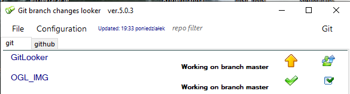
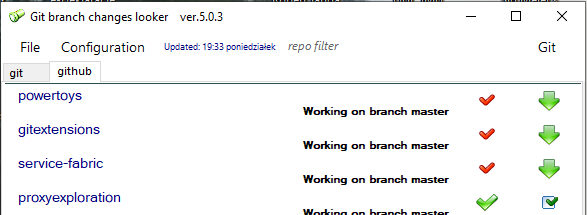
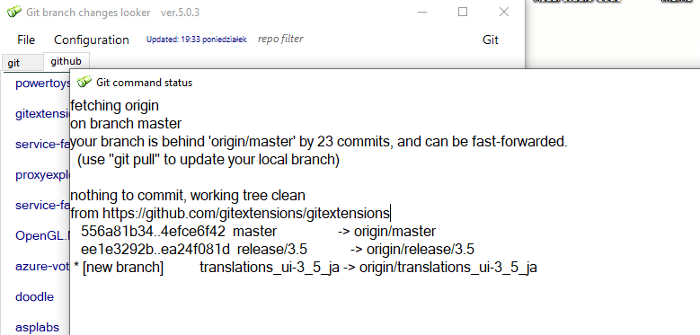
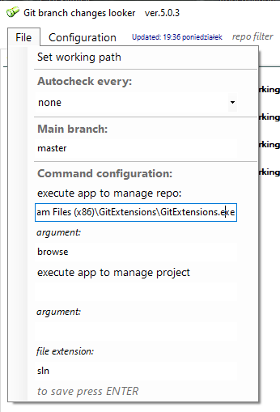
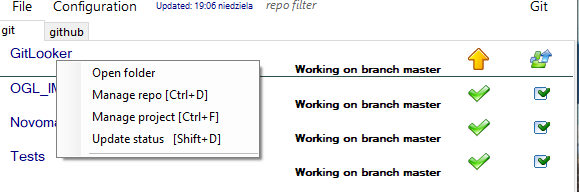
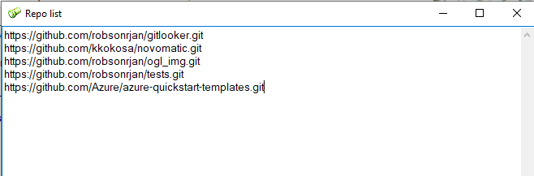
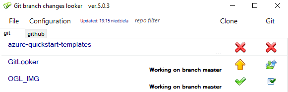

# GitLooker

**Pre requirements:**

Git - installed and configured,  
Enabled powershell.

**Repositorium changes watcher**

Application can ease maintain large amount of repositories showing repo status on form.
Also allow pull or reset master branch.  
Pick the catalog with repos and configure to automatic update and that's all.  
Then check repo status and current branch.

View git logs:

Configure one click repo management like [GitExtension](https://github.com/gitextensions/gitextensions#:~:text=GitHub%20-%20gitextensions%2Fgitextensions%3A%20Git%20Extensions%20is%20a%20standalone,with%20Windows%20Explorer%20and%20Microsoft%20Visual%20Studio%20%282015%2F2017%2F2019%29). or project management for file extension or catalog location like [Visual Code](https://code.visualstudio.com/).

Select repo and use one click option when is configured.

Add expected repo list to clone all to selected catalog.

Clone repos if they not present on the list.

To install -> 
- [Microsoft Store](https://www.microsoft.com/store/apps/9PK6TGX9T87P), 
- download latest release version and go to GitLookerSetup/bin/Release
for [MSI installable package](https://github.com/robsonrjan/GitLooker/releases).

